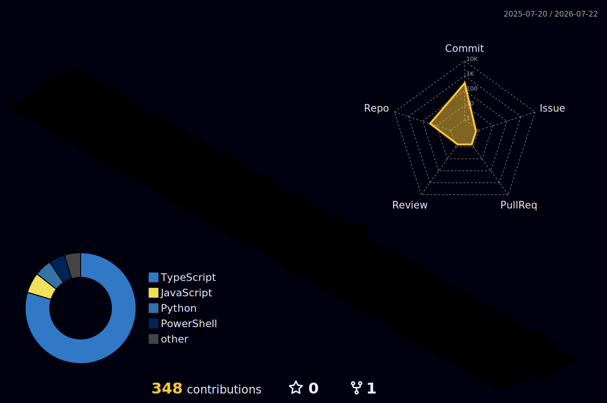

<!-- animated wave header -->
<div align="center">

</div>

<!-- typing animation -->
<div align="center">

[](https://git.io/typing-svg)

</div>

<!-- animated line -->


<!-- socials -->
<div align="center">
  <a href="https://github.com/tanzeelnaveed8">
    
  </a>
  <a href="https://linkedin.com/in/YOUR-LINKEDIN">
    
  </a>
  <a href="https://YOUR-PORTFOLIO.vercel.app">
    
  </a>
  <a href="mailto:YOUR_EMAIL@gmail.com">
    
  </a>
  <br><br>
  
</div>

<br>

<!-- about me with coding gif -->


## 💫 About Me

```typescript
const tanzeel = {
    role: "Full Stack Developer & AI Engineer",
    code: ["TypeScript", "JavaScript", "Python"],
    stack: {
        frontend: ["Next.js", "React", "Tailwind"],
        backend: ["Node.js", "Express", "FastAPI"],
        database: ["MongoDB", "PostgreSQL"],
        ai: ["OpenAI Agents SDK", "Gemini", "LLMs"]
    },
    currentFocus: "Building AI-Powered SaaS 🚀",
    funFact: "I debug with console.log and I'm proud"
};
```

- 🔭 building **ai-powered saas products**
- 🤖 exploring **agentic ai & llm integrations**
- ⚡ automating workflows so I can sleep more
- 🌱 currently learning **docker & openai agents sdk**

<br clear="right"/>


## 🛠️ Tech Arsenal

<div align="center">

### 💻 Languages & Frontend


### ⚙️ Backend & Database


### 🧰 Tools & Platforms


</div>


## 🚀 Featured Projects

<div align="center">

| 🎯 Project | 🛠️ Tech Stack | ✨ Highlight |
|:----------|:-------------|:------------|
| 🪄 **AI Virtual Try-On SaaS** | `Next.js` `Gemini AI` `Node.js` | ai-powered fashion experience |
| 🦷 **Dental Booking System** | `Next.js` `MongoDB` | full appointment automation |
| 📄 **AI Resume Builder** | `Next.js` `LLMs` | smart resume generation |
| 🛒 **Ecommerce Platform** | `Next.js` `Stripe` | complete payment flow |
| 🌐 **Portfolio Website** | `Next.js` `Tailwind` | modern & blazing fast |

</div>


## 📊 GitHub Analytics

<div align="center">
  
  
</div>

<div align="center">
  
</div>

<br>

<div align="center">
  
</div>


## 🎮 3D Contribution Graph

<div align="center">
  
</div>


## 🐍 Contribution Snake

<div align="center">
  
</div>


## 🏆 GitHub Trophies

<div align="center">
  
</div>


## 📚 Currently Learning

<div align="center">

`OpenAI Agents SDK` • `Agentic AI` • `FastAPI` • `LLMs` • `Workflow Automation` • `Docker`

</div>

<br>

<div align="center">
  
</div>

<!-- animated footer wave -->
<div align="center">

</div>
